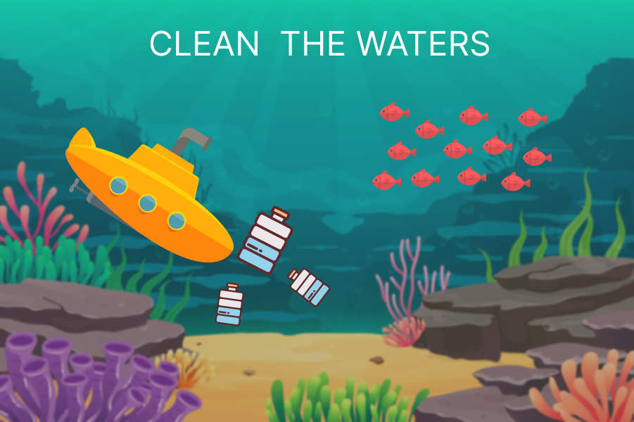

# Clean-the-waters

This is my first IronHack Project ! A fun and kid-firendly video game inspired by my passion for nature and obsession on plastic waste !
https://azienda-creativa.github.io/clean-the-waters/

# Description

Plastic is invading the water, BUT YOU CAN SAVE IT !

In this game you will collect plastic bottles from the water, the goal is to save the fish and gain points.
When a fish eats plastic by mistake, it will die and you lose 1 point.
Also when you bump onto a fish , it wil die and you lose 2 points.
It gets harder every minute.
You lose when hitting -1 points !

# MVP

- start and play-again button
- Simple and Fun UI
- implement google fonts
- able to drag the player with an under-water effect
- able to collect and count points
- add water sound
- add score sound
- increse handicap with time
- game over

# Backlog

- animate sprites player
- animate sprites allies
- implement scrolling background
- create levels and powerup

# Data Structure

main2.js
index.html
style.css

# States

# Task

# links

Intro presentation and wireframes
GitHub repository link
Deployment Link
